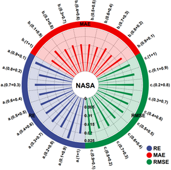
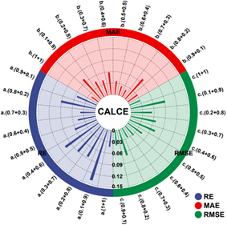

## 总框图

## 单步实验与多步实验

  
  
  

## 消融实验+对比实验

  
  
  

## 权值调试实验

## 实验环境
- Python 3.11.5 处理器
- Keras 3.3.3 深度学习框架
- Intel 64 Family 6 Model 191 Stepping 2处理器

### 引用
Chen C, Wu Y, Shi J, et al. A parallel weighted ADTC-Transformer framework with FUnet fusion and KAN for improved lithium-ion battery SOH prediction. *Control Engineering Practice*, 2025, 159: 106302.
