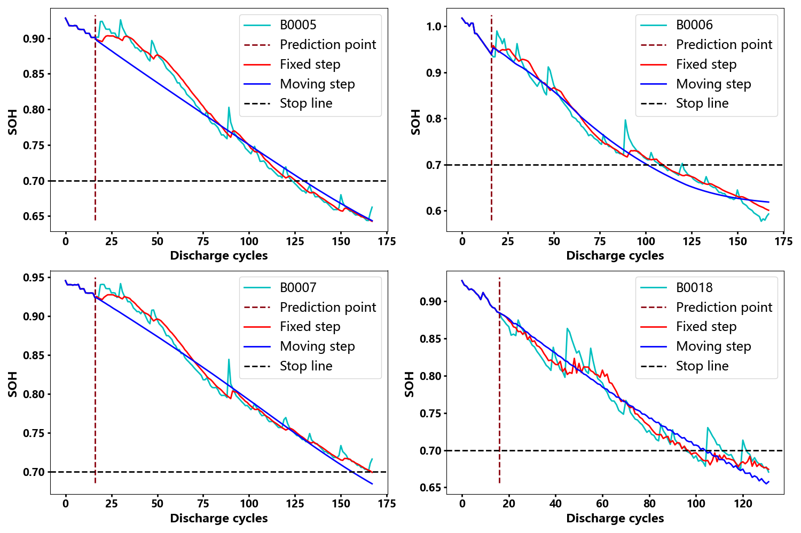

## 总框图

## 部分实验结果

## Packages
- Python 3.11.5 interpreter
- Keras 3.3.3
- Intel 64 Family 6 Model 191 Stepping 2 processor

### Citation
Chen C, Wu Y, Shi J, et al. A parallel weighted ADTC-Transformer framework with FUnet fusion and KAN for improved lithium-ion battery SOH prediction. *Control Engineering Practice*, 2025, 159: 106302.
